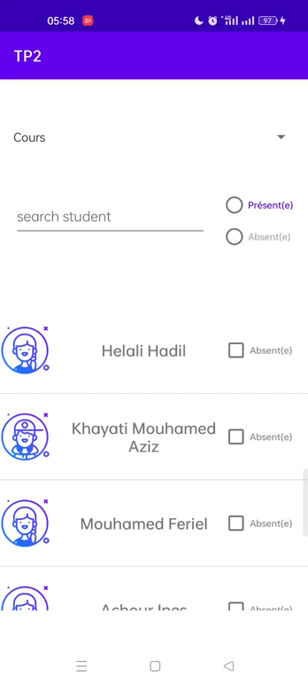

# Student_List
This is a simple application where you can filter a list of students according to the type of course ( cours / TP) or the state of the student (Present/Absent)

# Screenshots and Demo

<table>
  <tr>
    <td>First Screen Page</td>
     <td>Filter</td>
     <td>Search </td>
     <td>Demo</td>
  </tr>
  <tr>
    <td></td>
    <td></td>
    <td></td>
    <td></td>
    
  </tr>
 </table>
 

