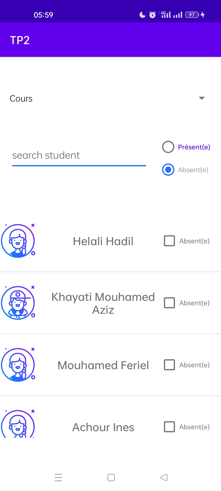
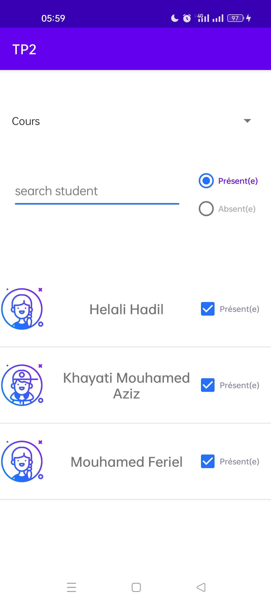
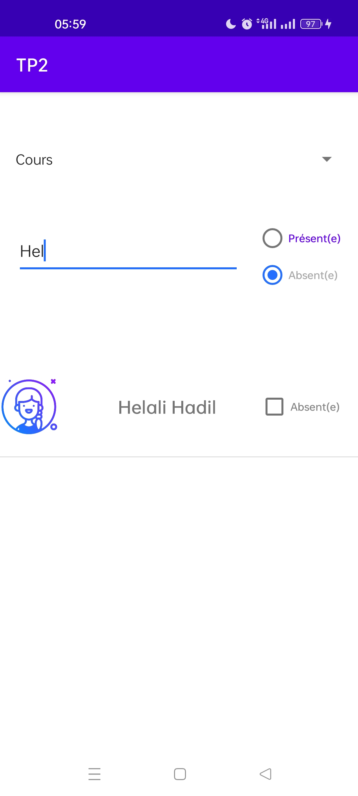

# Student_List
This is a simple application where you can filter a list of students according to the type of course ( cours / TP) or the state of the student (Present/Absent)
# Screenshots

# Demo 

